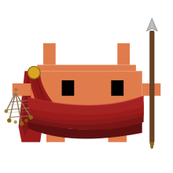

# claude-gladiator-mcp

A [Model Context Protocol (MCP)](https://modelcontextprotocol.io/) server that helps [Claude Code](https://docs.anthropic.com/en/docs/claude-code) learn from its own mistakes. Observe patterns during work, then reflect to get recommendations for updating your rules, hooks, and skills.

<br clear="right">


[](https://www.npmjs.com/package/claude-gladiator-mcp) [](https://opensource.org/licenses/MIT) [](https://www.typescriptlang.org/) [](https://nodejs.org/) [](#) [](https://github.com/Vvkmnn/claude-gladiator-mcp)

---

Inspired by the continuous learning experiments for Claude Code: [Everything Claude Code](https://github.com/Affaan-m/Everything-Claude-Code) by [Affaan-m](https://github.com/Affaan-m), [Claudeception](https://github.com/blader/claudeception) by [blader](https://github.com/blader), and [Homunculus](https://github.com/humanplane/homunculus) by [humanplane](https://github.com/humanplane). Research foundations: [Voyager](https://arxiv.org/abs/2305.16291) (Wang et al., 2023) and [Reflexion](https://arxiv.org/abs/2303.11366) (Shinn et al., 2023).

## install

**Requirements:**

[![Claude Code](https://img.shields.io/badge/Claude_Code-555?logo=data:image/svg%2bxml;base64,PHN2ZyB4bWxucz0iaHR0cDovL3d3dy53My5vcmcvMjAwMC9zdmciIHZpZXdCb3g9IjAgMCAxOCAxMCIgc2hhcGUtcmVuZGVyaW5nPSJjcmlzcEVkZ2VzIj4KICA8IS0tIENsYXdkOiBDbGF1ZGUgQ29kZSBtYXNjb3QgLS0+CiAgPCEtLSBEZWNvZGVkIGZyb206IOKWkOKWm+KWiOKWiOKWiOKWnOKWjCAvIOKWneKWnOKWiOKWiOKWiOKWiOKWiOKWm+KWmCAvIOKWmOKWmCDilp3ilp0gLS0+CiAgPCEtLSBTdWItcGl4ZWxzIGFyZSAxIHdpZGUgeCAyIHRhbGwgdG8gbWF0Y2ggdGVybWluYWwgY2hhciBjZWxsIGFzcGVjdCByYXRpbyAtLT4KICA8cmVjdCBmaWxsPSIjZDk3NzU3IiB4PSIzIiAgeT0iMCIgd2lkdGg9IjEyIiBoZWlnaHQ9IjIiLz4KICA8cmVjdCBmaWxsPSIjZDk3NzU3IiB4PSIzIiAgeT0iMiIgd2lkdGg9IjIiICBoZWlnaHQ9IjIiLz4KICA8cmVjdCBmaWxsPSIjZDk3NzU3IiB4PSI2IiAgeT0iMiIgd2lkdGg9IjYiICBoZWlnaHQ9IjIiLz4KICA8cmVjdCBmaWxsPSIjZDk3NzU3IiB4PSIxMyIgeT0iMiIgd2lkdGg9IjIiICBoZWlnaHQ9IjIiLz4KICA8cmVjdCBmaWxsPSIjZDk3NzU3IiB4PSIxIiAgeT0iNCIgd2lkdGg9IjE2IiBoZWlnaHQ9IjIiLz4KICA8cmVjdCBmaWxsPSIjZDk3NzU3IiB4PSIzIiAgeT0iNiIgd2lkdGg9IjEyIiBoZWlnaHQ9IjIiLz4KICA8cmVjdCBmaWxsPSIjZDk3NzU3IiB4PSI0IiAgeT0iOCIgd2lkdGg9IjEiICBoZWlnaHQ9IjIiLz4KICA8cmVjdCBmaWxsPSIjZDk3NzU3IiB4PSI2IiAgeT0iOCIgd2lkdGg9IjEiICBoZWlnaHQ9IjIiLz4KICA8cmVjdCBmaWxsPSIjZDk3NzU3IiB4PSIxMSIgeT0iOCIgd2lkdGg9IjEiICBoZWlnaHQ9IjIiLz4KICA8cmVjdCBmaWxsPSIjZDk3NzU3IiB4PSIxMyIgeT0iOCIgd2lkdGg9IjEiICBoZWlnaHQ9IjIiLz4KPC9zdmc+Cg==)](https://claude.ai/code)

**From shell:**

```bash
claude mcp add claude-gladiator-mcp -- npx claude-gladiator-mcp
```

**From inside Claude** (restart required):

```
Add this to our global mcp config: npx claude-gladiator-mcp

Install this mcp: https://github.com/Vvkmnn/claude-gladiator-mcp
```

**From any manually configurable `mcp.json`**: (Cursor, Windsurf, etc.)

```json
{
  "mcpServers": {
    "claude-gladiator-mcp": {
      "command": "npx",
      "args": ["claude-gladiator-mcp"],
      "env": {}
    }
  }
}
```

There is **no `npm install` required** — no external dependencies or local databases, only clustering algorithms.

## skill

Optionally, install the skill to teach Claude when to proactively observe and reflect:

```bash
npx skills add Vvkmnn/claude-gladiator-mcp --skill claude-gladiator --global
```

This makes Claude automatically observe tool failures, user corrections, and codebase patterns. The MCP works without the skill, but the skill improves discoverability.

## plugin

For automatic observation hooks and session-end reflection prompts, install from the [claude-emporium](https://github.com/Vvkmnn/claude-emporium) marketplace:

```bash
/plugin marketplace add Vvkmnn/claude-emporium
/plugin install claude-gladiator@claude-emporium
```

The **claude-gladiator** plugin provides:

**Hooks** (targeted, zero overhead on success):

- After Bash/Edit/Write errors → Observe failure pattern via `gladiator_observe`
- Before session ends → Reflect on unprocessed observations via `gladiator_reflect`

Requires the MCP server installed first. See the emporium for other Claude Code plugins and MCPs.

## features

[MCP server](https://modelcontextprotocol.io/) that gives Claude a learning loop. Observe patterns, cluster them, evolve your configuration.

#### `gladiator_observe`

Record a pattern worth learning from — tool failures, corrections, conventions, decisions. Deduplicates by SHA-256 hash of summary.

```
gladiator_observe summary=<summary> tags=<tags> context=<context>
  > "Edit failed on config.ts — 3 identical import blocks, fixed by including surrounding context"
  > "User wanted tests in __tests__/ not next to source — project convention"
  > "All API routes use zod validation middleware — schema in routes/schemas/"
```

```
┌─ ⚔ ───────────────────────────────────────────────────── Recorded ─┐
│ Edit failed on config.ts — 3 identical import blocks               │
│ Recommend (rule): Next time: included 3 lines above                │
│ Tags: edit, disambiguation                                         │
│ Backlog: 3 unprocessed of 12 total                                 │
└────────────────────────────────────────────────────────────────────┘
```

```json
{
  "id": "obs_1738012345_a7f3",
  "ts": "2025-01-27T18:32:25.000Z",
  "summary": "Edit failed on config.ts — 3 identical import blocks",
  "recommendation": "Next time: included 3 lines above",
  "artifact_type": "rule",
  "context": {
    "tool": "Edit",
    "error": "old_string not unique",
    "before": "used import line only",
    "after": "included 3 lines above"
  },
  "tags": ["edit", "disambiguation"],
  "processed": false
}
```

#### `gladiator_reflect`

Cluster unprocessed observations, scan existing `~/.claude/rules/`, `~/.claude/hooks/`, and `~/.claude/skills/`, and recommend whether to **update an existing artifact** or **create a new one**.

```
gladiator_reflect
  > "I've accumulated 5 observations about edit failures — what patterns emerge?"
  > "Review what I've learned this session before it's lost"

gladiator_reflect query="testing"
  > "Search past observations about testing conventions"
```

**Cluster mode** (unprocessed observations exist):

```
┌─ ⚔ ──────────────────────────────────────────────────── Reflected ─┐
│ 5 observations → 2 groups                                          │
│ 8 existing artifacts scanned (IDF-weighted)                        │
│                                                                    │
│ UPDATE avoid: edit-disambiguation (3 obs)                          │
│   - Next time: included 3 lines above                              │
│   - Include surrounding function context for disambiguation        │
│   - Check for duplicate imports before editing                     │
│ NEW rule: testing-convention (2 obs)                               │
│   - Next time: moved to __tests__/utils.test.ts                    │
│   - Use __tests__/ directory for all test files                    │
└────────────────────────────────────────────────────────────────────┘
```

```json
{
  "observations_analyzed": 5,
  "groups_found": 2,
  "existing_artifacts_scanned": 8,
  "groups": [
    {
      "suggested_name": "edit-disambiguation",
      "artifact_type": "rule",
      "tags": ["edit", "disambiguation", "old_string"],
      "action": "update",
      "update_targets": [{ "type": "rule", "name": "avoid", "path": "~/.claude/rules/avoid.md" }],
      "observations": ["..."]
    },
    {
      "suggested_name": "testing-convention",
      "artifact_type": "rule",
      "tags": ["convention", "testing"],
      "action": "create",
      "update_targets": [],
      "observations": ["..."]
    }
  ],
  "actions": [
    "PREFER updating existing artifacts over creating new ones",
    "Consolidate related observations into a single change when possible",
    "Only create new artifacts when no existing one covers the topic"
  ]
}
```

**Stats mode** (nothing unprocessed):

```
┌─ ⚔ ──────────────────────────────────────────────────────── Stats ─┐
│ Observations: 12 total, 0 unprocessed                              │
│   rule: 8                                                          │
│   skill: 3                                                         │
│   hook: 1                                                          │
└────────────────────────────────────────────────────────────────────┘
```

**Query mode** (`gladiator_reflect query="edit"`):

```
┌─ ⚔ ──────────────────────────────────────────────────────── Found ─┐
│ "edit" — 4 observations                                            │
│   Edit failed on config.ts — 3 identical import (2h ago)           │
│   Edit old_string matched wrong function in uti (1d ago)           │
│   Edit succeeded after adding file_path context (3d ago)           │
│   Edit conflict on package.json — concurrent wr (5d ago)           │
└────────────────────────────────────────────────────────────────────┘
```

## methodology

How [claude-gladiator-mcp](https://github.com/Vvkmnn/claude-gladiator-mcp) [works](https://github.com/Vvkmnn/claude-gladiator-mcp/tree/main/src):

```
gladiator_observe(summary, tags, context)
      │
      ├─ dedup ─── SHA-256(summary) vs last 100 ─── duplicate? → skip
      ├─ classify ─ tags + context → rule | skill | hook | agent
      ├─ recommend  context.after → "Next time: ..."
      └─ append ─── → observations.jsonl


gladiator_reflect(query?, limit?)
      │
      ├─ query? ──────── search all by summary/tags/error → return matches
      │
      ├─ 0 unprocessed ─ return stats: total, by_type, recent 5
      │
      └─ N unprocessed ─┐
          │              │
          ├─ cluster ─── Jaccard(tags) > 0.3 → merge into groups
          │              majority-vote artifact_type per group
          │
          ├─ scan ────── rules/*.md + hooks/* + skills/*/SKILL.md
          │              extract keywords (>3 chars) per artifact
          │
          ├─ score ───── IDF: 1/docFreq(word) per shared keyword
          │              filter words in >40% of artifacts
          │              name match bonus: +5
          │              threshold: >= 3.0 → "update"
          │
          ├─ mark ────── processed = true
          │
          └─ return ──── per cluster: action, targets, observations
```

**Core algorithms:**

- **[Jaccard clustering](https://en.wikipedia.org/wiki/Jaccard_index)** ([`clusterObservations`](https://github.com/Vvkmnn/claude-gladiator-mcp/blob/main/src/index.ts#L342)): Groups observations with tag overlap > 0.3, majority-votes artifact type per cluster
- **[IDF-weighted scoring](https://en.wikipedia.org/wiki/Tf%E2%80%93idf)** ([`findOverlappingArtifacts`](https://github.com/Vvkmnn/claude-gladiator-mcp/blob/main/src/index.ts#L281)): Scores clusters against existing artifacts, weighting rare words higher (`1/docFreq`), filtering words in >40% of docs
- **[Content-based dedup](https://en.wikipedia.org/wiki/Data_deduplication)** ([`hashSummary`](https://github.com/Vvkmnn/claude-gladiator-mcp/blob/main/src/index.ts#L130)): SHA-256 prefix (8 hex chars) of lowercased summary, checked against last 100 observations
- **[Auto-classification](https://en.wikipedia.org/wiki/Text_classification)** ([`classifyArtifact`](https://github.com/Vvkmnn/claude-gladiator-mcp/blob/main/src/index.ts#L144)): Keyword regex on tags for hook/agent, context heuristic for skill, default rule

**File access:**

- Reads/writes: `~/.claude/gladiator/observations.jsonl` (JSONL, each line is a self-contained JSON object with timestamp, summary, tags, context, and processing state)
- Scans (read-only): `~/.claude/rules/`, `~/.claude/hooks/`, `~/.claude/skills/`
- Zero external dependencies
- Never leaves your machine

## development

```bash
git clone https://github.com/Vvkmnn/claude-gladiator-mcp && cd claude-gladiator-mcp
npm install && npm run build
npm test
```

**Package requirements:**

- **Node.js**: >=20.0.0 (ES modules)
- **Runtime**: `@modelcontextprotocol/sdk`, `zod`
- **Zero external databases** — works with `npx`

**Development workflow:**

```bash
npm run build          # TypeScript compilation with executable permissions
npm run dev            # Watch mode with tsc --watch
npm run start          # Run the MCP server directly
npm run lint           # ESLint code quality checks
npm run lint:fix       # Auto-fix linting issues
npm run format         # Prettier formatting (src/)
npm run format:check   # Check formatting without changes
npm run typecheck      # TypeScript validation without emit
npm run test           # Lint + type check
npm run prepublishOnly # Pre-publish validation (build + lint + format:check)
```

**Git hooks (via Husky):**

- **pre-commit**: Auto-formats staged `.ts` files with Prettier and ESLint

Contributing:

- Fork the repository and create feature branches
- Follow TypeScript strict mode and [MCP protocol](https://modelcontextprotocol.io/specification) standards

Learn from examples:

- [Official MCP servers](https://github.com/modelcontextprotocol/servers) for reference implementations
- [TypeScript SDK](https://github.com/modelcontextprotocol/typescript-sdk) for best practices
- [Creating Node.js modules](https://docs.npmjs.com/creating-node-js-modules) for npm package development

## license

[MIT](LICENSE)

<hr>

<a href="https://en.wikipedia.org/wiki/Pollice_Verso_(G%C3%A9r%C3%B4me)"></a>

_**[Pollice Verso](https://en.wikipedia.org/wiki/Pollice_Verso_(G%C3%A9r%C3%B4me))** by **[Jean-Léon Gérôme](https://en.wikipedia.org/wiki/Jean-L%C3%A9on_G%C3%A9r%C3%B4me)** (1872). "Ave Imperator, morituri te salutant." [Claudius](https://en.wikipedia.org/wiki/Claudius) replied "Aut non" (or not)._
